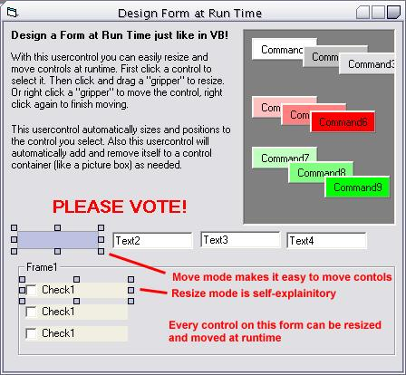



## Design a Form at Run Time just like in VB\!

### Description

With this usercontrol you can easily resize and move controls at runtime. First click a control to select it. Then click and drag a "gripper" to resize. Or right click a "gripper" to move the control, right click again to finish moving.

 

This usercontrol automatically sizes and positions to the control you select. Also this usercontrol will automatically add and remove itself to a control container (like a picture box) as needed.
 
### More Info
 

             |
---                |---
**Submitted On**   |2002-05-08 01:56:00
**By**             |[Bryan A\. Cairns](https://github.com/Planet-Source-Code/PSCIndex/blob/master/ByAuthor/bryan-a-cairns.md)
**Level**          |Beginner
**User Rating**    |4.9 (163 globes from 33 users)
**Compatibility**  |VB 5\.0, VB 6\.0
**Category**       |[OLE/ COM/ DCOM/ Active\-X](https://github.com/Planet-Source-Code/PSCIndex/blob/master/ByCategory/ole-com-dcom-active-x__1-29.md)
**World**          |[Visual Basic](https://github.com/Planet-Source-Code/PSCIndex/blob/master/ByWorld/visual-basic.md)
**Archive File**   |[Design\_a\_F80613582002\.zip](https://github.com/Planet-Source-Code/bryan-a-cairns-design-a-form-at-run-time-just-like-in-vb__1-34549/archive/master.zip)

